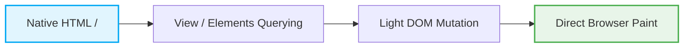
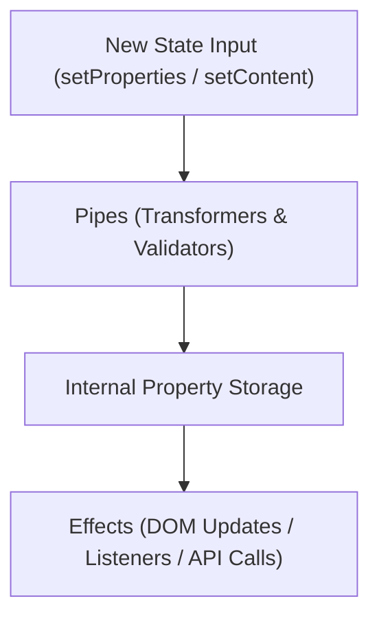

# Core Concepts & Architecture

`olo-front` is intentionally engineered around a few foundational principles that set it apart from conventional virtual DOM or compiler-driven frameworks.

---

## 1. Light DOM & Buildless Philosophy

Modern frontend engineering often introduces layers of abstraction (Virtual DOM, JSX compilers, Webpack/Bite plugins, Shadow DOM) that disconnect code from the browser's native capabilities.

`olo-front` embraces native Web APIs:

- **Light DOM Scoping**: Rather than isolating styles and markup inside Shadow DOM, `olo-front` operates in the standard Light DOM. Scoping is achieved deterministically through data attributes (`data-olo-component` and `data-olo-name`).
- **Native `<template>` Elements**: Dynamic templates and views are cloned directly from standard HTML `<template>` elements via `document.importNode` or `cloneNode`.
- **Zero Runtime Dependencies**: The entire framework is pure ECMAScript and native DOM APIs.
- **Buildless Ready**: Source code uses standard ES module imports with `.js` extensions. You can serve it directly from a web server without running a bundler.



---

## 2. Predictable Reactivity: Pipes & Effects

Instead of hidden proxies, compiler macros, or global signal graphs, `olo-front` employs an explicit **Pipeline & Side-Effect** architecture implemented in the base `Module` class.

Every reactive entity (such as `State` or `Mode`) derives from `Module`.



### Pipes (Before State Changes)
Pipes run **synchronously before** the state value is committed. A pipe receives the incoming data and must return the transformed or sanitized data:

```javascript
state.addPipe('properties', (props) => {
  return {
    ...props,
    normalizedEmail: props.email?.trim().toLowerCase(),
    fullName: `${props.firstName || ''} ${props.lastName || ''}`.trim(),
  };
});
```

### Effects (After State Changes)
Effects run **after** the state value has been successfully committed. An effect is the place to trigger DOM updates, log analytics, or dispatch events:

```javascript
state.addEffect('properties', (props, options, deps) => {
  console.log('State updated:', props);
  if (deps.elements) {
    deps.elements.update({ name: 'username' }, props.normalizedEmail);
  }
});
```

---

## 3. Strict Abstraction Boundaries

To maintain long-term maintainability and high testability:

- **Logical modules (`State`, `Module`, `Mode`) are DOM-agnostic.** They contain pure data transformations and business rules. They do not invoke `document.querySelector` or touch DOM nodes directly.
- **View modules (`Elements`, `View`, `Meta`) bridge logic to the browser.** All mutations, queries, and browser API interactions must flow through these modules.

This clear boundary allows you to unit-test state logic and state machines inside Node.js or happy-dom without needing complex browser simulations.

---

## 4. Teardown Hygiene with `AbortController`

A frequent source of memory leaks in Single Page Applications (SPAs) and dynamic components is dangling event listeners and lingering intervals.

`olo-front` solves this through the `Events` module:
- Event listeners registered via `Events.add(...)` are bound to an internal `AbortController`.
- When a component is removed or destroyed, calling `this.events.stopAll()` instantly aborts the signal and detaches every listener simultaneously.

```javascript
class MyComponent extends Component {
  destroy() {
    super.destroy(); // Automatically cleans up this.events and this.children
  }
}
```

---

## 5. Pluggable Dependency Injection

All core modules follow a constructor signature:

```javascript
constructor(options = {}, dependencies = {})
```

Instead of hardcoding references to companion classes, modules receive dependencies explicitly. This allows painless mocking in tests:

```javascript
// Production
const component = new Component(options, config, { Elements, State, Events });

// Unit Test with Mock Elements
const mockElements = { get: vi.fn(), update: vi.fn() };
const testComponent = new Component(options, config, { Elements: mockElements, State });
```

---

## 6. HTML Data Attribute Conventions

| Attribute | Role | Purpose |
| :--- | :--- | :--- |
| `data-olo-component="<name>"` | Component Root | Marks the boundary of a component scope |
| `data-olo-name="<name>"` | Scoped Query | Identifies an element inside a view or component |
| `data-olo-view="<name>"` | View Variant | Differentiates template states or layout variants |
| `data-olo-mode="<modes>"` | State Machine | Space-separated list of active UI modes (e.g., `PENDING OPEN`) |
| `data-olo-static="<name>"` | Static Placeholder | Marker for pre-rendered or initial content slots |
| `data-olo-dynamic="<name>"` | Dynamic Placeholder | Marker for dynamic list insertion or lazy-loaded views |

---

## Next Steps

- Delve into [State & Reactivity](./modules/state-and-reactivity.md) to learn about hierarchical trees and bidirectional traversal.
- Learn how [Component & ComponentBuilder](./modules/component.md) manage lifecycles and dynamic templates.

