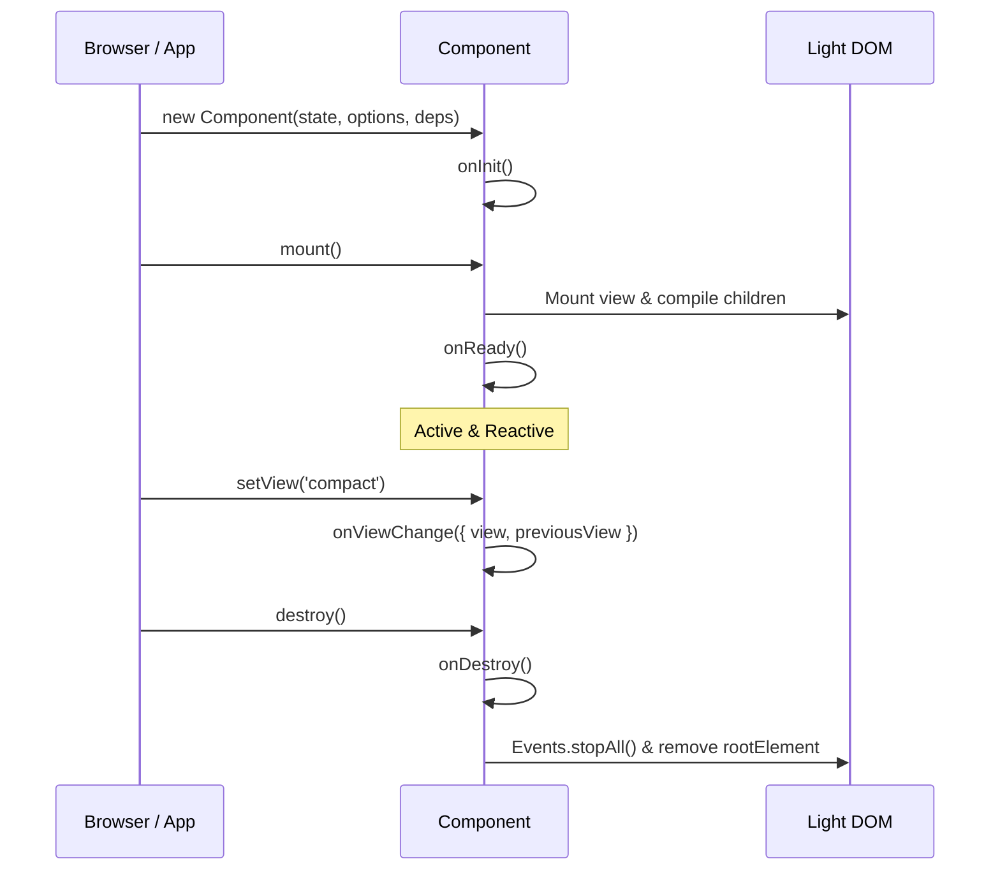

# Component & ComponentBuilder

The `Component` class is the central orchestrator in `olo-front`. It brings together `State`, `Elements`, `Events`, and `Router` under a unified, declarative lifecycle.

---

## 1. Anatomy of a Component

A component extends `Component` and passes its initial state and options to `super()` (companion dependencies like `Elements`, `State`, and `Events` are auto-wired by default via `Module.dependencies`):

```javascript
import { Component } from 'olo-front';

export class UserCard extends Component {
  constructor(rootElement, initialUser = {}) {
    super(
      // 1. Initial State Configuration
      {
        name: `user-${initialUser.id || 'anonymous'}`,
        component: 'user-card',
        content: {
          name: initialUser.name ?? 'Guest',
          bio: initialUser.bio ?? '',
        },
        properties: {
          isAdmin: Boolean(initialUser.isAdmin),
        },
        mode: ['ACTIVE'],
      },
      // 2. Component Options
      {
        rootElement,
      }
      // 3. Dependencies are optional — default dependencies are auto-wired via Module.dependencies!
    );
  }

  // Lifecycle Hook: Executed when the component is ready and attached
  async onReady() {
    // Scoped ID helper for accessibility attributes
    const inputId = this.id('input'); // e.g. "user-12-input"

    // Add event listener with automatic cleanup on destroy
    const editBtn = this.elements.get({ name: 'editBtn' });
    if (editBtn) {
      this.events.listen({
        target: editBtn,
        event: 'click',
        callback: () => {
          this.state.setMode(['EDITING']);
        },
      });
    }
  }

  // Lifecycle Hook: Invoked when active view/template switches
  async onViewChange({ view, previousView, rootElement }) {
    console.log(`Switched view from ${previousView} to ${view}`);
  }

  // Cleanup hook
  onDestroy() {
    console.log(`Component ${this.name} destroyed`);
  }
}
```

---

## 2. Built-in Instance Properties

Inside your component methods, you have access to:

| Property | Type | Description |
| :--- | :--- | :--- |
| `this.name` | `string` | Unique instance name (`data-olo-name`) |
| `this.component` | `string` | Component type identifier (`data-olo-component`) |
| `this.rootElement` | `HTMLElement` | Root element in the DOM for this component |
| `this.state` | `StateModule` | Reactive state node managing content, properties, and modes |
| `this.elements` | `ElementsModule` | Scoped DOM querying, placeholder replacement, and templating |
| `this.events` | `EventsModule` | Lifecycle-aware event listener manager |
| `this.router` | `RouterModule` | Local router instance (if configured) |
| `this.ready` | `Promise<Component>` | Resolves when `onReady` completes |

### Instance-Scoped IDs: `this.id(suffix)`
To link `<label for="...">` and `<input id="...">` or ARIA attributes without causing clashes across multiple component instances, use `this.id(suffix)`:
```javascript
const checkboxId = this.id('terms-toggle'); // => "user-anonymous-terms-toggle"
```

---

## 3. Lifecycle Hooks

`Component` provides asynchronous lifecycle hooks that you can override:



- **`onInit()`**: Called immediately after state, elements, and event wrappers are established.
- **`onReady()`**: Called after `mount()` has completed and child components have been initialized.
- **`onViewChange({ view, previousView, rootElement })`**: Fired after switching view templates via `setView()`.
- **`onAddChild(child)` / `onRemoveChild(child)`**: Fired when child components are dynamically added or removed.
- **`onError(error, context)`**: Centralized error boundary hook for rendering or view-compilation failures.
- **`onDestroy()`**: Called right before listeners are aborted, child states detached, and the root element removed.

---

## 4. Multi-View Switching: `setView(name)`

Components can alternate between different `<template>` representations (e.g. `card`, `table-row`, `full-detail`):

```javascript
// Switches the component's rendered HTML to the 'editing' template
await userCard.setView('editing');
```

When switching views:
1. `olo-front` clones the new template via `Elements`.
2. Re-binds child states and syncs `content` and `properties` to the new markup.
3. Automatically tears down previous event listeners via `Events.stopAll()`.
4. Triggers `onViewChange`.

---

## 5. Dynamic Loading with `ComponentBuilder`

`ComponentBuilder` manages asynchronous registration, dynamic template fetching, and lazy-loading of components:

```javascript
import { ComponentBuilder } from 'olo-front';

const builder = new ComponentBuilder({
  components: {
    'todo-item': () => import('./components/todo-item.js'),
    'modal-dialog': () => import('./components/modal-dialog.js'),
  },
  fetchTemplate: async (component, view) => {
    const res = await fetch(`/templates/${component}.${view}.html`);
    return res.text();
  },
});

// Mount all components found in document body
await builder.build(document.body);
```

### Exponential Backoff & Retry
Network requests in `ComponentBuilder` include built-in exponential backoff retries, ensuring resilient hydration in slow or flaky network conditions.

